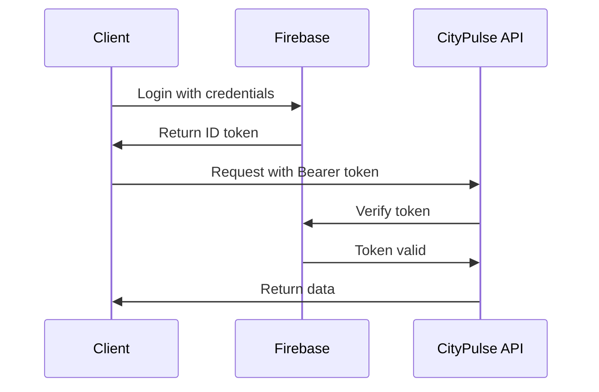

# CityPulse API Guide

**Version**: 1.0.0
**Base URL**: `[Your CityPulse URL]`
**Authentication**: Bearer Token (Firebase Auth)

## 📚 Related Documentation
- **[Architecture](./ARCHITECTURE.md)** - System architecture and design
- **[Database Schema](./DATABASE_SCHEMA.md)** - Database structure and relationships
- **[Security Operations](./SECURITY_OPERATIONS.md)** - Authentication and security procedures
- **[Deployment Guide](./DEPLOYMENT.md)** - API deployment and configuration
- **[Troubleshooting](./TROUBLESHOOTING.md)** - Common API issues and solutions

---

## Table of Contents

1. [Quick Start](#quick-start)
2. [Authentication](#authentication)
3. [Events API](#events-api)
4. [Users API](#users-api)
5. [Feedback API](#feedback-api)
6. [Analytics API](#analytics-api)
7. [Code Examples](#code-examples)
8. [Error Handling](#error-handling)
9. [Rate Limiting](#rate-limiting)
10. [SDKs and Libraries](#sdks-and-libraries)

---

## Quick Start

### 🚀 5-Minute Integration

```javascript
// 1. Install the SDK
npm install @citypulse/api-client

// 2. Initialize client
import { CityPulseClient } from '@citypulse/api-client';

const client = new CityPulseClient({
  apiKey: 'your-api-key',
  baseURL: '[Your CityPulse URL]'
});

// 3. Fetch events
const events = await client.events.list({
  category: 'traffic',
  limit: 10
});

console.log('Recent traffic events:', events.data);
```

### 📋 Prerequisites

- **API Key**: Obtain from CityPulse Developer Console
- **Authentication**: Firebase Auth token for user-specific operations
- **Rate Limits**: 1000 requests/hour for free tier

---

## Authentication

### 🔐 API Key Authentication

**For public data access (read-only)**:

```bash
curl -H "X-API-Key: your-api-key" \
  [Your CityPulse URL]
```

### 🎫 Bearer Token Authentication

**For user-specific operations**:

```javascript
// Get Firebase Auth token
import { getAuth } from 'firebase/auth';

const auth = getAuth();
const user = auth.currentUser;
const token = await user.getIdToken();

// Use in API requests
const response = await fetch('/api/v1/events', {
  headers: {
    'Authorization': `Bearer ${token}`,
    'Content-Type': 'application/json'
  }
});
```

### 🔑 Authentication Flow



---

## Events API

### 📍 List Events

**Endpoint**: `GET /events`

```bash
curl -H "X-API-Key: your-api-key" \
  "[Your CityPulse URL]?category=traffic&limit=10"
```

**Parameters**:
```typescript
interface EventListParams {
  category?: 'traffic' | 'safety' | 'civic' | 'weather' | 'social';
  severity?: 'low' | 'medium' | 'high' | 'critical';
  status?: 'active' | 'resolved' | 'monitoring';
  location?: {
    lat: number;
    lng: number;
    radius: number; // kilometers
  };
  limit?: number; // max 100
  offset?: number;
  start_date?: string; // ISO 8601
  end_date?: string;   // ISO 8601
}
```

**Response**:
```json
{
  "data": [
    {
      "id": "evt_123456",
      "title": "Traffic Accident on Main St",
      "description": "Multi-vehicle accident blocking two lanes",
      "category": "traffic",
      "severity": "high",
      "status": "active",
      "location": {
        "lat": 34.0522,
        "lng": -118.2437,
        "address": "Main St & 1st Ave, Downtown"
      },
      "start_time": "2025-01-15T14:30:00Z",
      "source": "citizen",
      "ai_summary": "Traffic disruption expected for 2-3 hours",
      "created_at": "2025-01-15T14:32:00Z",
      "updated_at": "2025-01-15T14:35:00Z"
    }
  ],
  "pagination": {
    "total": 156,
    "limit": 10,
    "offset": 0,
    "has_more": true
  }
}
```

### 📝 Create Event

**Endpoint**: `POST /events`  
**Authentication**: Required

```javascript
const newEvent = await fetch('/api/v1/events', {
  method: 'POST',
  headers: {
    'Authorization': `Bearer ${token}`,
    'Content-Type': 'application/json'
  },
  body: JSON.stringify({
    title: 'Pothole on Oak Street',
    description: 'Large pothole causing vehicle damage',
    category: 'infrastructure',
    severity: 'medium',
    location: {
      lat: 34.0522,
      lng: -118.2437,
      address: 'Oak St near City Hall'
    },
    metadata: {
      reporter_contact: 'optional-email@example.com'
    }
  })
});

const event = await newEvent.json();
console.log('Created event:', event.data.id);
```

### 🔍 Get Event Details

**Endpoint**: `GET /events/{eventId}`

```bash
curl -H "X-API-Key: your-api-key" \
  [Your CityPulse URL]_123456
```

**Response**:
```json
{
  "data": {
    "id": "evt_123456",
    "title": "Traffic Accident on Main St",
    "description": "Multi-vehicle accident blocking two lanes",
    "category": "traffic",
    "severity": "high",
    "status": "active",
    "location": {
      "lat": 34.0522,
      "lng": -118.2437,
      "address": "Main St & 1st Ave, Downtown"
    },
    "start_time": "2025-01-15T14:30:00Z",
    "end_time": null,
    "source": "citizen",
    "user_id": "user_789",
    "ai_summary": "Traffic disruption expected for 2-3 hours",
    "ai_category": "traffic_accident",
    "ai_image_tags": ["vehicles", "road", "emergency"],
    "metadata": {
      "vehicles_involved": 3,
      "lanes_blocked": 2,
      "emergency_services": true
    },
    "created_at": "2025-01-15T14:32:00Z",
    "updated_at": "2025-01-15T14:35:00Z"
  }
}
```

### ✏️ Update Event

**Endpoint**: `PUT /events/{eventId}`  
**Authentication**: Required (Authority/Admin only)

```javascript
const updateEvent = await fetch(`/api/v1/events/${eventId}`, {
  method: 'PUT',
  headers: {
    'Authorization': `Bearer ${token}`,
    'Content-Type': 'application/json'
  },
  body: JSON.stringify({
    status: 'resolved',
    end_time: new Date().toISOString(),
    metadata: {
      resolution_notes: 'Accident cleared, traffic flowing normally'
    }
  })
});
```

---

## Users API

### 👤 Get User Profile

**Endpoint**: `GET /users/me`  
**Authentication**: Required

```javascript
const profile = await fetch('/api/v1/users/me', {
  headers: {
    'Authorization': `Bearer ${token}`
  }
});

const userData = await profile.json();
console.log('User profile:', userData.data);
```

**Response**:
```json
{
  "data": {
    "user_id": "user_789",
    "email": "john.doe@example.com",
    "display_name": "John Doe",
    "roles": ["user"],
    "preferences": {
      "alert_categories": ["traffic", "safety"],
      "notification_radius": 5,
      "language": "en"
    },
    "notification_settings": {
      "email": true,
      "push": true,
      "in_app": true
    },
    "is_active": true,
    "created_at": "2025-01-01T00:00:00Z",
    "last_login": "2025-01-15T14:00:00Z"
  }
}
```

### ⚙️ Update User Preferences

**Endpoint**: `PATCH /users/me`  
**Authentication**: Required

```javascript
const updatePreferences = await fetch('/api/v1/users/me', {
  method: 'PATCH',
  headers: {
    'Authorization': `Bearer ${token}`,
    'Content-Type': 'application/json'
  },
  body: JSON.stringify({
    preferences: {
      alert_categories: ['traffic', 'safety', 'weather'],
      notification_radius: 10
    },
    notification_settings: {
      email: false,
      push: true,
      in_app: true
    }
  })
});
```

---

## Feedback API

### 💬 Submit Feedback

**Endpoint**: `POST /feedback`  
**Authentication**: Required

```javascript
const feedback = await fetch('/api/v1/feedback', {
  method: 'POST',
  headers: {
    'Authorization': `Bearer ${token}`,
    'Content-Type': 'application/json'
  },
  body: JSON.stringify({
    type: 'ai_correction',
    title: 'Incorrect event categorization',
    description: 'This traffic event was miscategorized as safety',
    related_entity: {
      type: 'event',
      id: 'evt_123456'
    },
    ai_accuracy_rating: 2,
    corrected_category: 'traffic'
  })
});
```

### 📋 List User Feedback

**Endpoint**: `GET /feedback`  
**Authentication**: Required

```bash
curl -H "Authorization: Bearer your-token" \
  "[Your CityPulse URL]?status=open"
```

---

## Analytics API

### 📊 Get Event Trends

**Endpoint**: `GET /analytics/trends`

```javascript
const trends = await fetch('/api/v1/analytics/trends?' + new URLSearchParams({
  category: 'traffic',
  start_date: '2025-01-01',
  end_date: '2025-01-15',
  granularity: 'daily'
}), {
  headers: {
    'X-API-Key': 'your-api-key'
  }
});

const trendData = await trends.json();
```

**Response**:
```json
{
  "data": {
    "category": "traffic",
    "period": {
      "start": "2025-01-01T00:00:00Z",
      "end": "2025-01-15T23:59:59Z"
    },
    "granularity": "daily",
    "metrics": [
      {
        "date": "2025-01-01",
        "event_count": 23,
        "avg_severity": 2.1,
        "resolution_time_avg": 3.5
      },
      {
        "date": "2025-01-02",
        "event_count": 31,
        "avg_severity": 2.3,
        "resolution_time_avg": 2.8
      }
    ],
    "summary": {
      "total_events": 387,
      "avg_daily_events": 25.8,
      "trend": "increasing"
    }
  }
}
```

---

## Code Examples

### 🔄 Real-time Event Streaming

```javascript
// Using Server-Sent Events
const eventSource = new EventSource(
  '[Your CityPulse URL]?category=traffic',
  {
    headers: {
      'Authorization': `Bearer ${token}`
    }
  }
);

eventSource.onmessage = (event) => {
  const eventData = JSON.parse(event.data);
  console.log('New event:', eventData);
  
  // Update UI with new event
  updateMapMarker(eventData);
};

eventSource.onerror = (error) => {
  console.error('Stream error:', error);
  // Implement reconnection logic
};
```

### 📱 Mobile Integration (React Native)

```javascript
import { CityPulseClient } from '@citypulse/react-native';

const client = new CityPulseClient({
  apiKey: 'your-api-key'
});

// Get user location and nearby events
const getUserLocationEvents = async () => {
  try {
    const location = await getCurrentLocation();
    
    const events = await client.events.list({
      location: {
        lat: location.latitude,
        lng: location.longitude,
        radius: 5 // 5km radius
      },
      status: 'active',
      limit: 20
    });
    
    return events.data;
  } catch (error) {
    console.error('Error fetching events:', error);
  }
};
```

### 🌐 Web Integration (React)

```jsx
import React, { useState, useEffect } from 'react';
import { useCityPulse } from '@citypulse/react';

const EventMap = () => {
  const { events, loading, error } = useCityPulse({
    category: 'traffic',
    autoRefresh: true,
    refreshInterval: 30000 // 30 seconds
  });

  if (loading) return <div>Loading events...</div>;
  if (error) return <div>Error: {error.message}</div>;

  return (
    <div className="event-map">
      {events.map(event => (
        <EventMarker 
          key={event.id} 
          event={event}
          onClick={() => showEventDetails(event)}
        />
      ))}
    </div>
  );
};
```

### 🔍 Advanced Filtering

```javascript
// Complex query with multiple filters
const complexQuery = {
  filters: {
    and: [
      { category: { in: ['traffic', 'safety'] } },
      { severity: { gte: 'medium' } },
      { created_at: { gte: '2025-01-01T00:00:00Z' } },
      {
        location: {
          within: {
            type: 'polygon',
            coordinates: [
              [-118.5, 34.0],
              [-118.2, 34.0],
              [-118.2, 34.3],
              [-118.5, 34.3],
              [-118.5, 34.0]
            ]
          }
        }
      }
    ]
  },
  sort: [
    { field: 'severity', order: 'desc' },
    { field: 'created_at', order: 'desc' }
  ],
  limit: 50
};

const events = await client.events.search(complexQuery);
```

---

## Error Handling

### 📋 Error Response Format

```json
{
  "error": {
    "code": "VALIDATION_ERROR",
    "message": "Invalid request parameters",
    "details": [
      {
        "field": "category",
        "message": "Must be one of: traffic, safety, civic, weather, social"
      }
    ],
    "request_id": "req_abc123"
  }
}
```

### 🔧 Common Error Codes

| Code | HTTP Status | Description |
|------|-------------|-------------|
| `INVALID_API_KEY` | 401 | API key missing or invalid |
| `UNAUTHORIZED` | 401 | Authentication required |
| `FORBIDDEN` | 403 | Insufficient permissions |
| `NOT_FOUND` | 404 | Resource not found |
| `VALIDATION_ERROR` | 400 | Invalid request parameters |
| `RATE_LIMIT_EXCEEDED` | 429 | Too many requests |
| `INTERNAL_ERROR` | 500 | Server error |

### 🛠️ Error Handling Best Practices

```javascript
const handleApiCall = async (apiCall) => {
  try {
    const response = await apiCall();
    return response;
  } catch (error) {
    switch (error.code) {
      case 'RATE_LIMIT_EXCEEDED':
        // Implement exponential backoff
        await delay(error.retry_after * 1000);
        return handleApiCall(apiCall);
        
      case 'UNAUTHORIZED':
        // Refresh auth token
        await refreshAuthToken();
        return handleApiCall(apiCall);
        
      case 'VALIDATION_ERROR':
        // Show user-friendly validation errors
        showValidationErrors(error.details);
        break;
        
      default:
        // Log error and show generic message
        console.error('API Error:', error);
        showErrorMessage('Something went wrong. Please try again.');
    }
  }
};
```

---

## Rate Limiting

### 📊 Rate Limits

| Tier | Requests/Hour | Requests/Minute |
|------|---------------|-----------------|
| Free | 1,000 | 50 |
| Basic | 10,000 | 500 |
| Pro | 100,000 | 2,000 |
| Enterprise | Unlimited | 10,000 |

### 🔄 Rate Limit Headers

```
X-RateLimit-Limit: 1000
X-RateLimit-Remaining: 999
X-RateLimit-Reset: 1642694400
Retry-After: 3600
```

### ⏱️ Handling Rate Limits

```javascript
const makeRequestWithRetry = async (url, options, maxRetries = 3) => {
  for (let i = 0; i < maxRetries; i++) {
    try {
      const response = await fetch(url, options);
      
      if (response.status === 429) {
        const retryAfter = response.headers.get('Retry-After');
        await delay(retryAfter * 1000);
        continue;
      }
      
      return response;
    } catch (error) {
      if (i === maxRetries - 1) throw error;
      await delay(Math.pow(2, i) * 1000); // Exponential backoff
    }
  }
};
```

---

## SDKs and Libraries

### 📚 Official SDKs

```bash
# JavaScript/TypeScript
npm install @citypulse/api-client

# React
npm install @citypulse/react

# React Native
npm install @citypulse/react-native

# Python
pip install citypulse-python

# PHP
composer require citypulse/php-sdk

# Java
implementation 'com.citypulse:java-sdk:1.0.0'
```

### 🔗 Community Libraries

- **Go**: `github.com/community/citypulse-go`
- **Ruby**: `gem install citypulse-ruby`
- **C#**: `NuGet: CityPulse.NET`
- **Swift**: `github.com/community/citypulse-swift`

---

*For more examples and detailed API reference, visit our [Developer Portal]([Your CityPulse URL]).*

