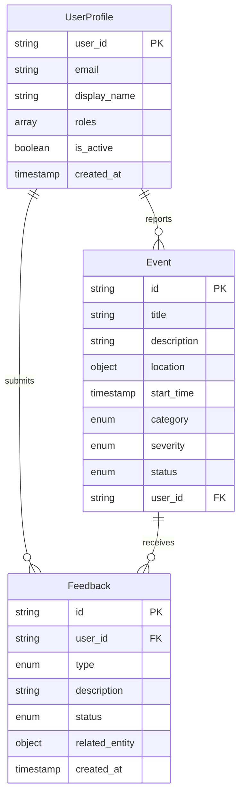
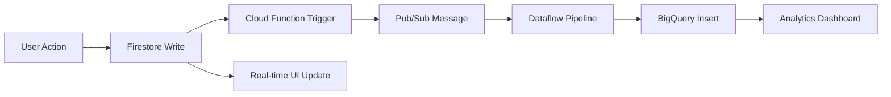

# CityPulse Database Schema Documentation

**Version**: 1.0.0  
**Last Updated**: July 9, 2025
**Database Systems**: Firestore (Real-time) + BigQuery (Analytics)  

---

## Overview

CityPulse uses a **hybrid database architecture** combining Firestore for real-time operations and BigQuery for analytics. This design optimizes for both low-latency user interactions and complex analytical queries.

### Architecture Pattern
```
User Actions → Firestore (Real-time) → Pub/Sub → BigQuery (Analytics)
```

---

## 1. Firestore Schema

### 1.1 Collections Overview

| Collection | Purpose | Document Count | Real-time |
|------------|---------|----------------|-----------|
| `events` | City events and incidents | ~10K/month | ✅ Yes |
| `user_profiles` | User account information | ~1K users | ✅ Yes |
| `user_feedback` | User feedback and ratings | ~5K/month | ✅ Yes |

### 1.2 Event Collection

**Collection Path**: `/events/{eventId}`

```typescript
interface Event {
  // Core Fields
  id?: string;                    // Auto-generated document ID
  title: string;                  // Event title (required)
  description?: string;           // Detailed description
  
  // Location Data
  location?: {
    latitude: number;             // GPS coordinates
    longitude: number;
    address?: string;             // Human-readable address
    ward?: string;                // Administrative division
  };
  
  // Temporal Data
  start_time: Timestamp;          // Event start time
  end_time?: Timestamp;           // Event end time (optional)
  created_at: Timestamp;          // Document creation
  updated_at: Timestamp;          // Last modification
  
  // Classification
  category?: EventCategory;       // TRAFFIC | SAFETY | CIVIC | WEATHER | SOCIAL
  severity?: EventSeverity;       // LOW | MEDIUM | HIGH | CRITICAL
  source?: EventSource;           // CITIZEN | OFFICIAL | SENSOR | SOCIAL_MEDIA
  status: EventStatus;            // ACTIVE | RESOLVED | MONITORING | ARCHIVED
  
  // User Association
  user_id?: string;               // Reporting user ID
  
  // AI Processing
  ai_summary?: string;            // AI-generated summary
  ai_category?: string;           // AI-determined category
  ai_image_tags?: string[];       // AI-extracted image tags
  ai_generated_image_url?: string; // AI-generated visualization
  
  // Metadata
  metadata: Record<string, any>;  // Flexible additional data
}
```

**Enums**:
```typescript
enum EventCategory {
  TRAFFIC = "traffic",
  SAFETY = "safety", 
  CIVIC = "civic",
  WEATHER = "weather",
  SOCIAL = "social"
}

enum EventSeverity {
  LOW = "low",
  MEDIUM = "medium", 
  HIGH = "high",
  CRITICAL = "critical"
}

enum EventSource {
  CITIZEN = "citizen",
  OFFICIAL = "official",
  SENSOR = "sensor", 
  SOCIAL_MEDIA = "social_media"
}

enum EventStatus {
  ACTIVE = "active",
  RESOLVED = "resolved",
  MONITORING = "monitoring",
  ARCHIVED = "archived"
}
```

**Indexes**:
- Composite: `(category, status, start_time)`
- Composite: `(severity, status, created_at)`
- Single: `user_id`, `status`, `category`
- Geospatial: `location` (for proximity queries)

### 1.3 User Profile Collection

**Collection Path**: `/user_profiles/{userId}`

```typescript
interface UserProfile {
  // Identity
  user_id: string;                // Firebase Auth UID (document ID)
  email?: string;                 // User email
  display_name?: string;          // Public display name
  photo_url?: string;             // Profile picture URL
  
  // Preferences
  preferences: {
    alert_categories: EventCategory[];
    notification_radius: number;   // Kilometers
    language: string;             // Locale preference
  };
  
  // Notification Settings
  notification_settings: {
    email: boolean;
    push: boolean;
    in_app: boolean;
  };
  
  // Authorization
  roles: UserRole[];              // USER | MODERATOR | ADMIN
  is_active: boolean;             // Account status
  
  // Activity Tracking
  last_login?: Timestamp;
  created_at: Timestamp;
  updated_at: Timestamp;
}
```

**Enums**:
```typescript
enum UserRole {
  USER = "user",
  MODERATOR = "moderator", 
  ADMIN = "admin"
}
```

**Indexes**:
- Single: `roles`, `is_active`, `last_login`
- Composite: `(roles, is_active)`

### 1.4 Feedback Collection

**Collection Path**: `/user_feedback/{feedbackId}`

```typescript
interface Feedback {
  // Core Fields
  id?: string;                    // Auto-generated
  user_id: string;                // Submitting user
  
  // Content
  type: FeedbackType;             // BUG | FEATURE_REQUEST | GENERAL | etc.
  title?: string;                 // Brief title
  description: string;            // Detailed feedback
  
  // Management
  status: FeedbackStatus;         // OPEN | IN_REVIEW | RESOLVED | etc.
  assigned_to?: string;           // Admin user ID
  admin_notes?: string;           // Internal notes
  resolution_date?: Timestamp;
  
  // Relationships
  related_entity?: {
    type: string;                 // "event" | "user" | etc.
    id: string;                   // Related entity ID
  };
  
  // AI Feedback Specific
  ai_accuracy_rating?: number;    // 1-5 rating
  corrected_category?: string;
  corrected_summary?: string;
  
  // Metadata
  metadata: Record<string, any>;
  created_at: Timestamp;
  updated_at: Timestamp;
}
```

**Enums**:
```typescript
enum FeedbackType {
  BUG = "bug",
  FEATURE_REQUEST = "feature_request",
  GENERAL = "general",
  DATA_ISSUE = "data_issue", 
  AI_CORRECTION = "ai_correction",
  OTHER = "other"
}

enum FeedbackStatus {
  OPEN = "open",
  IN_REVIEW = "in_review",
  RESOLVED = "resolved",
  WONT_FIX = "wont_fix",
  DUPLICATE = "duplicate"
}
```

---

## 2. BigQuery Schema

### 2.1 Events Analytics Table

**Table**: `city_intelligence.events`

```sql
CREATE TABLE city_intelligence.events (
  -- Primary Keys
  event_id STRING NOT NULL,
  
  -- Event Details
  event_type STRING NOT NULL,
  title STRING,
  description STRING,
  
  -- Location
  location_lat FLOAT64,
  location_lng FLOAT64,
  ward_name STRING,
  
  -- Temporal
  timestamp TIMESTAMP NOT NULL,
  end_timestamp TIMESTAMP,
  
  -- Classification
  source_type STRING NOT NULL,
  severity_level STRING,
  status STRING,
  
  -- Analytics
  cluster_id STRING,
  confidence_score FLOAT64,
  sentiment_score FLOAT64,
  
  -- Arrays
  tags ARRAY<STRING>,
  media_urls ARRAY<STRING>,
  
  -- AI Processing
  ai_summary STRING,
  ai_category STRING,
  ai_image_tags ARRAY<STRING>,
  
  -- Metadata
  user_id STRING,
  metadata JSON,
  
  -- Audit
  created_at TIMESTAMP DEFAULT CURRENT_TIMESTAMP(),
  updated_at TIMESTAMP DEFAULT CURRENT_TIMESTAMP()
)
PARTITION BY DATE(timestamp)
CLUSTER BY ward_name, event_type, severity_level;
```

**Partitioning Strategy**:
- **Partition Field**: `DATE(timestamp)`
- **Retention**: 7 years (configurable)
- **Benefits**: Query performance, cost optimization

**Clustering Strategy**:
- **Cluster Fields**: `ward_name`, `event_type`, `severity_level`
- **Benefits**: Improved query performance for common filters

### 2.2 User Analytics Table

**Table**: `city_intelligence.user_analytics`

```sql
CREATE TABLE city_intelligence.user_analytics (
  user_id STRING NOT NULL,
  session_id STRING,
  action_type STRING NOT NULL,
  event_id STRING,
  timestamp TIMESTAMP NOT NULL,
  location_lat FLOAT64,
  location_lng FLOAT64,
  device_info STRUCT<
    platform STRING,
    version STRING,
    user_agent STRING
  >,
  metadata JSON,
  created_at TIMESTAMP DEFAULT CURRENT_TIMESTAMP()
)
PARTITION BY DATE(timestamp)
CLUSTER BY user_id, action_type;
```

---

## 3. Data Relationships

### 3.1 Entity Relationship Diagram



### 3.2 Data Flow



---

## 4. Performance Considerations

### 4.1 Firestore Optimization

**Read Optimization**:
- Use composite indexes for complex queries
- Implement pagination for large result sets
- Cache frequently accessed data

**Write Optimization**:
- Batch writes when possible
- Use transactions for data consistency
- Implement optimistic locking

### 4.2 BigQuery Optimization

**Query Optimization**:
- Use partitioning for time-based queries
- Leverage clustering for common filters
- Implement materialized views for complex aggregations

**Cost Optimization**:
- Use appropriate data types
- Implement data lifecycle policies
- Monitor query costs and optimize expensive queries

---

## 5. Security and Access Control

### 5.1 Firestore Security Rules

```javascript
rules_version = '2';
service cloud.firestore {
  match /databases/{database}/documents {
    // Events: Read public, write authenticated
    match /events/{eventId} {
      allow read: if true;
      allow write: if request.auth != null;
    }
    
    // User profiles: Users can only access their own
    match /user_profiles/{userId} {
      allow read, write: if request.auth != null && request.auth.uid == userId;
    }
    
    // Feedback: Users can read/write their own, admins can read all
    match /user_feedback/{feedbackId} {
      allow read, write: if request.auth != null && 
        (request.auth.uid == resource.data.user_id || 
         'admin' in request.auth.token.roles);
    }
  }
}
```

### 5.2 BigQuery Access Control

**IAM Roles**:
- `bigquery.dataViewer`: Read-only access for analysts
- `bigquery.dataEditor`: Write access for data pipelines
- `bigquery.admin`: Full access for administrators

---

## 6. Migration and Versioning

### 6.1 Schema Evolution Strategy

**Firestore**:
- Additive changes only (new fields)
- Use optional fields for backward compatibility
- Implement data migration functions for breaking changes

**BigQuery**:
- Use `ALTER TABLE` for schema changes
- Implement versioned table names for major changes
- Maintain backward compatibility views

### 6.2 Migration Procedures

1. **Plan Migration**: Document changes and impact
2. **Test in Staging**: Validate migration scripts
3. **Backup Data**: Create snapshots before migration
4. **Execute Migration**: Run migration during low-traffic periods
5. **Validate Results**: Verify data integrity post-migration
6. **Monitor Performance**: Check for performance impacts

---

## 7. Monitoring and Maintenance

### 7.1 Health Metrics

**Firestore**:
- Read/write operations per second
- Document count per collection
- Index usage statistics
- Error rates and latency

**BigQuery**:
- Query performance metrics
- Storage usage and costs
- Slot utilization
- Data freshness

### 7.2 Maintenance Tasks

**Daily**:
- Monitor error rates and performance
- Check data pipeline health
- Validate data quality

**Weekly**:
- Review storage usage and costs
- Analyze query performance
- Update indexes if needed

**Monthly**:
- Review and optimize expensive queries
- Clean up old data per retention policies
- Update documentation for schema changes

---

*This schema documentation provides the foundation for understanding and working with CityPulse data structures.*

