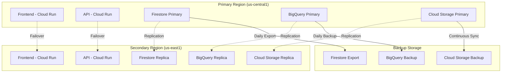
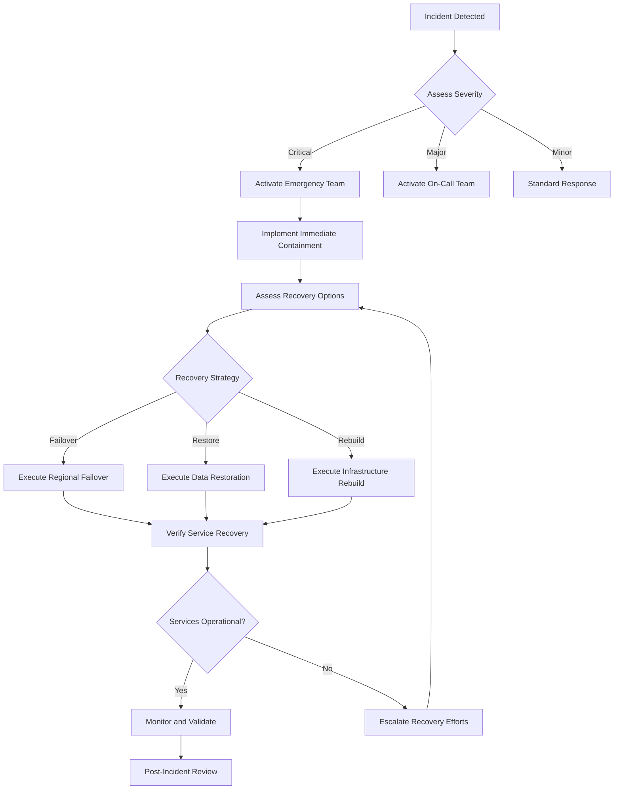

# CityPulse Disaster Recovery Plan

**Version**: 1.0.0  
**Last Updated**: July 12, 2025
**Classification**: Confidential  
**Target Audience**: DevOps Engineers, System Administrators, Management  

---

## Table of Contents

1. [Overview](#overview)
2. [Recovery Objectives](#recovery-objectives)
3. [Backup Strategies](#backup-strategies)
4. [Recovery Procedures](#recovery-procedures)

---

## Overview

### 🎯 Purpose

This Disaster Recovery Plan (DRP) provides comprehensive procedures for recovering CityPulse services in the event of system failures, natural disasters, cyber attacks, or other catastrophic events that could impact service availability.

### 📋 Scope

This plan covers:
- **Infrastructure**: Google Cloud Platform resources
- **Applications**: Frontend, API, and data processing pipelines
- **Data**: Firestore, BigQuery, and Cloud Storage
- **External Dependencies**: Third-party services and integrations

### 🏗️ Architecture Overview



---

## Recovery Objectives

### 📊 Service Level Objectives (SLOs)

| Service Component | RTO (Recovery Time) | RPO (Recovery Point) | Availability Target |
|-------------------|---------------------|----------------------|-------------------|
| **Frontend Web App** | 15 minutes | 5 minutes | 99.9% |
| **API Services** | 30 minutes | 5 minutes | 99.9% |
| **Real-time Data (Firestore)** | 1 hour | 15 minutes | 99.95% |
| **Analytics Data (BigQuery)** | 4 hours | 1 hour | 99.5% |
| **File Storage** | 2 hours | 30 minutes | 99.9% |
| **Data Pipelines** | 2 hours | 1 hour | 99.5% |

### 🎯 Business Impact Analysis

#### Critical Services (Tier 1)
- **User Authentication**: Essential for all operations
- **Event Reporting**: Core citizen functionality
- **Real-time Map**: Primary user interface
- **Emergency Alerts**: Public safety critical

#### Important Services (Tier 2)
- **Analytics Dashboard**: Authority operations
- **Data Processing Pipelines**: Background operations
- **User Management**: Administrative functions
- **API Documentation**: Developer resources

#### Standard Services (Tier 3)
- **Historical Analytics**: Reporting and insights
- **Feedback System**: User experience enhancement
- **Administrative Tools**: System management

---

## Backup Strategies

### 💾 Data Backup Procedures

#### Firestore Backup

```bash
#!/bin/bash
# Automated Firestore backup script

PROJECT_ID="citypulse-project"
BACKUP_BUCKET="citypulse-backups"
DATE=$(date +%Y%m%d-%H%M%S)

# Export Firestore collections
export_firestore() {
    echo "Starting Firestore export at $(date)"
    
    gcloud firestore export gs://${BACKUP_BUCKET}/firestore-exports/${DATE} \
        --project=${PROJECT_ID} \
        --async
    
    # Wait for export to complete
    operation_id=$(gcloud firestore operations list --filter="RUNNING" --format="value(name)" | head -1)
    
    if [[ -n "$operation_id" ]]; then
        echo "Waiting for export operation: $operation_id"
        gcloud firestore operations wait $operation_id
        echo "Firestore export completed successfully"
    fi
}

# Verify backup integrity
verify_backup() {
    echo "Verifying backup integrity..."
    
    # Check if backup files exist
    gsutil ls gs://${BACKUP_BUCKET}/firestore-exports/${DATE}/ > /dev/null
    
    if [[ $? -eq 0 ]]; then
        echo "Backup verification successful"
        
        # Log backup completion
        echo "$(date): Firestore backup completed - gs://${BACKUP_BUCKET}/firestore-exports/${DATE}" >> /var/log/citypulse/backup.log
    else
        echo "ERROR: Backup verification failed"
        exit 1
    fi
}

# Cleanup old backups (keep last 30 days)
cleanup_old_backups() {
    echo "Cleaning up old backups..."
    
    # Delete backups older than 30 days
    gsutil -m rm -r gs://${BACKUP_BUCKET}/firestore-exports/$(date -d '30 days ago' +%Y%m%d)*
}

# Main backup routine
main() {
    export_firestore
    verify_backup
    cleanup_old_backups
    
    echo "Firestore backup process completed at $(date)"
}

# Run backup
main
```

#### BigQuery Backup

```sql
-- BigQuery backup procedures

-- 1. Create backup dataset
CREATE SCHEMA IF NOT EXISTS `citypulse-project.backup_$(FORMAT_DATE('%Y%m%d', CURRENT_DATE()))`
OPTIONS (
  description = 'Daily backup dataset',
  location = 'US'
);

-- 2. Backup events table
CREATE TABLE `citypulse-project.backup_$(FORMAT_DATE('%Y%m%d', CURRENT_DATE())).events`
PARTITION BY DATE(timestamp)
CLUSTER BY ward_name, event_type
AS
SELECT * FROM `citypulse-project.city_intelligence.events`
WHERE DATE(timestamp) >= DATE_SUB(CURRENT_DATE(), INTERVAL 7 DAY);

-- 3. Backup user analytics
CREATE TABLE `citypulse-project.backup_$(FORMAT_DATE('%Y%m%d', CURRENT_DATE())).user_analytics`
PARTITION BY DATE(timestamp)
CLUSTER BY user_id, action_type
AS
SELECT * FROM `citypulse-project.city_intelligence.user_analytics`
WHERE DATE(timestamp) >= DATE_SUB(CURRENT_DATE(), INTERVAL 7 DAY);

-- 4. Export to Cloud Storage for long-term retention
EXPORT DATA OPTIONS(
  uri='gs://citypulse-backups/bigquery-exports/$(FORMAT_DATE('%Y%m%d', CURRENT_DATE()))/*.parquet',
  format='PARQUET',
  overwrite=true
) AS
SELECT * FROM `citypulse-project.city_intelligence.events`
WHERE DATE(timestamp) >= DATE_SUB(CURRENT_DATE(), INTERVAL 30 DAY);
```

#### Application Code Backup

```yaml
# GitHub Actions workflow for code backup
name: Code Backup
on:
  schedule:
    - cron: '0 3 * * *'  # Daily at 3 AM
  workflow_dispatch:

jobs:
  backup-code:
    runs-on: ubuntu-latest
    steps:
    - name: Checkout code
      uses: actions/checkout@v4
      with:
        fetch-depth: 0  # Full history
    
    - name: Create backup archive
      run: |
        DATE=$(date +%Y%m%d-%H%M%S)
        tar -czf citypulse-code-backup-${DATE}.tar.gz \
          --exclude='.git' \
          --exclude='node_modules' \
          --exclude='__pycache__' \
          .
    
    - name: Upload to Cloud Storage
      uses: google-github-actions/upload-cloud-storage@v1
      with:
        path: citypulse-code-backup-*.tar.gz
        destination: citypulse-backups/code-backups/
        credentials: ${{ secrets.GCP_SA_KEY }}
    
    - name: Cleanup old backups
      run: |
        # Keep last 30 days of backups
        gsutil -m rm gs://citypulse-backups/code-backups/citypulse-code-backup-$(date -d '30 days ago' +%Y%m%d)*.tar.gz || true
```

### 🔄 Backup Automation

```python
# Comprehensive backup orchestration
import subprocess
import logging
import datetime
import json
from google.cloud import storage, firestore, bigquery

class BackupOrchestrator:
    def __init__(self, project_id: str, backup_bucket: str):
        self.project_id = project_id
        self.backup_bucket = backup_bucket
        self.storage_client = storage.Client()
        self.firestore_client = firestore.Client()
        self.bigquery_client = bigquery.Client()
        
        # Setup logging
        logging.basicConfig(
            level=logging.INFO,
            format='%(asctime)s - %(levelname)s - %(message)s',
            handlers=[
                logging.FileHandler('/var/log/citypulse/backup.log'),
                logging.StreamHandler()
            ]
        )
        self.logger = logging.getLogger(__name__)
    
    def run_full_backup(self):
        """Execute complete backup procedure"""
        backup_id = datetime.datetime.now().strftime('%Y%m%d-%H%M%S')
        
        try:
            self.logger.info(f"Starting full backup: {backup_id}")
            
            # Backup Firestore
            firestore_success = self.backup_firestore(backup_id)
            
            # Backup BigQuery
            bigquery_success = self.backup_bigquery(backup_id)
            
            # Backup Cloud Storage
            storage_success = self.backup_cloud_storage(backup_id)
            
            # Backup configuration
            config_success = self.backup_configuration(backup_id)
            
            # Generate backup report
            self.generate_backup_report(backup_id, {
                'firestore': firestore_success,
                'bigquery': bigquery_success,
                'storage': storage_success,
                'configuration': config_success
            })
            
            self.logger.info(f"Full backup completed: {backup_id}")
            
        except Exception as e:
            self.logger.error(f"Backup failed: {str(e)}")
            self.send_backup_alert(backup_id, str(e))
            raise
    
    def backup_firestore(self, backup_id: str) -> bool:
        """Backup Firestore data"""
        try:
            self.logger.info("Starting Firestore backup")
            
            # Export Firestore
            operation = self.firestore_client._firestore_api.export_documents(
                request={
                    'name': f'projects/{self.project_id}/databases/(default)',
                    'output_uri_prefix': f'gs://{self.backup_bucket}/firestore/{backup_id}'
                }
            )
            
            # Wait for completion (simplified)
            self.logger.info("Firestore backup initiated successfully")
            return True
            
        except Exception as e:
            self.logger.error(f"Firestore backup failed: {str(e)}")
            return False
    
    def backup_bigquery(self, backup_id: str) -> bool:
        """Backup BigQuery data"""
        try:
            self.logger.info("Starting BigQuery backup")
            
            # List all tables to backup
            dataset_ref = self.bigquery_client.dataset('city_intelligence')
            tables = list(self.bigquery_client.list_tables(dataset_ref))
            
            for table in tables:
                # Export each table
                destination_uri = f'gs://{self.backup_bucket}/bigquery/{backup_id}/{table.table_id}/*.parquet'
                
                job_config = bigquery.ExtractJobConfig()
                job_config.destination_format = bigquery.DestinationFormat.PARQUET
                
                extract_job = self.bigquery_client.extract_table(
                    table,
                    destination_uri,
                    job_config=job_config
                )
                
                extract_job.result()  # Wait for completion
                
            self.logger.info("BigQuery backup completed successfully")
            return True
            
        except Exception as e:
            self.logger.error(f"BigQuery backup failed: {str(e)}")
            return False
    
    def generate_backup_report(self, backup_id: str, results: dict):
        """Generate backup completion report"""
        report = {
            'backup_id': backup_id,
            'timestamp': datetime.datetime.now().isoformat(),
            'results': results,
            'overall_success': all(results.values())
        }
        
        # Save report to Cloud Storage
        bucket = self.storage_client.bucket(self.backup_bucket)
        blob = bucket.blob(f'reports/backup-report-{backup_id}.json')
        blob.upload_from_string(json.dumps(report, indent=2))
        
        self.logger.info(f"Backup report generated: {backup_id}")
```

---

## Recovery Procedures

### 🚨 Emergency Response Workflow



### 🔄 Service Recovery Procedures

#### Frontend Application Recovery

```bash
#!/bin/bash
# Frontend service recovery script

REGION_PRIMARY="us-central1"
REGION_SECONDARY="us-east1"
SERVICE_NAME="citypulse-frontend"

recover_frontend() {
    echo "Starting frontend recovery process..."
    
    # Check primary region status
    primary_status=$(gcloud run services describe $SERVICE_NAME \
        --region=$REGION_PRIMARY \
        --format="value(status.conditions[0].status)" 2>/dev/null || echo "FAILED")
    
    if [[ "$primary_status" != "True" ]]; then
        echo "Primary region unavailable, initiating failover..."
        
        # Update DNS to point to secondary region
        gcloud dns record-sets transaction start --zone=citypulse-zone
        
        gcloud dns record-sets transaction remove \
            --zone=citypulse-zone \
            --name=[your-citypulse-domain]. \
            --type=A \
            --ttl=300 \
            --rrdatas="$(get_primary_ip)"
        
        gcloud dns record-sets transaction add \
            --zone=citypulse-zone \
            --name=[your-citypulse-domain]. \
            --type=A \
            --ttl=60 \
            --rrdatas="$(get_secondary_ip)"
        
        gcloud dns record-sets transaction execute --zone=citypulse-zone
        
        echo "DNS failover completed"
        
        # Verify secondary region service
        verify_service_health "[Your CityPulse URL]"
        
    else
        echo "Primary region operational, checking service health..."
        
        # Restart service if unhealthy
        if ! verify_service_health "[Your CityPulse URL]"; then
            echo "Service unhealthy, restarting..."
            
            gcloud run services update $SERVICE_NAME \
                --region=$REGION_PRIMARY \
                --update-env-vars="RESTART_TIMESTAMP=$(date +%s)"
            
            # Wait for deployment
            gcloud run services wait $SERVICE_NAME --region=$REGION_PRIMARY
        fi
    fi
    
    echo "Frontend recovery completed"
}

verify_service_health() {
    local url=$1
    local max_attempts=10
    local attempt=1
    
    while [[ $attempt -le $max_attempts ]]; do
        if curl -f -s "$url" > /dev/null; then
            echo "Service health check passed"
            return 0
        fi
        
        echo "Health check attempt $attempt failed, retrying..."
        sleep 30
        ((attempt++))
    done
    
    echo "Service health check failed after $max_attempts attempts"
    return 1
}

get_primary_ip() {
    gcloud run services describe $SERVICE_NAME \
        --region=$REGION_PRIMARY \
        --format="value(status.url)" | sed 's|https://||'
}

get_secondary_ip() {
    gcloud run services describe $SERVICE_NAME \
        --region=$REGION_SECONDARY \
        --format="value(status.url)" | sed 's|https://||'
}

# Execute recovery
recover_frontend
```

#### Database Recovery

```python
# Database recovery procedures
import time
import logging
from google.cloud import firestore, bigquery
from google.cloud.exceptions import NotFound

class DatabaseRecovery:
    def __init__(self, project_id: str, backup_bucket: str):
        self.project_id = project_id
        self.backup_bucket = backup_bucket
        self.firestore_client = firestore.Client()
        self.bigquery_client = bigquery.Client()
        
        logging.basicConfig(level=logging.INFO)
        self.logger = logging.getLogger(__name__)
    
    def recover_firestore(self, backup_date: str):
        """Recover Firestore from backup"""
        try:
            self.logger.info(f"Starting Firestore recovery from backup: {backup_date}")
            
            # Import from backup
            operation = self.firestore_client._firestore_api.import_documents(
                request={
                    'name': f'projects/{self.project_id}/databases/(default)',
                    'input_uri_prefix': f'gs://{self.backup_bucket}/firestore/{backup_date}'
                }
            )
            
            self.logger.info("Firestore import operation started")
            
            # Monitor operation progress
            while not operation.done():
                self.logger.info("Waiting for Firestore import to complete...")
                time.sleep(60)
                operation = self.firestore_client._firestore_api.get_operation(
                    request={'name': operation.name}
                )
            
            if operation.error:
                raise Exception(f"Import failed: {operation.error}")
            
            self.logger.info("Firestore recovery completed successfully")
            
            # Verify data integrity
            self.verify_firestore_data()
            
        except Exception as e:
            self.logger.error(f"Firestore recovery failed: {str(e)}")
            raise
    
    def recover_bigquery(self, backup_date: str):
        """Recover BigQuery from backup"""
        try:
            self.logger.info(f"Starting BigQuery recovery from backup: {backup_date}")
            
            # List backup files
            backup_uri = f'gs://{self.backup_bucket}/bigquery/{backup_date}/'
            
            # Restore each table
            tables_to_restore = ['events', 'user_analytics', 'feedback']
            
            for table_name in tables_to_restore:
                self.restore_bigquery_table(table_name, backup_date)
            
            self.logger.info("BigQuery recovery completed successfully")
            
        except Exception as e:
            self.logger.error(f"BigQuery recovery failed: {str(e)}")
            raise
    
    def restore_bigquery_table(self, table_name: str, backup_date: str):
        """Restore individual BigQuery table"""
        dataset_id = 'city_intelligence'
        table_id = table_name
        
        # Create table reference
        table_ref = self.bigquery_client.dataset(dataset_id).table(table_id)
        
        # Configure load job
        job_config = bigquery.LoadJobConfig()
        job_config.source_format = bigquery.SourceFormat.PARQUET
        job_config.write_disposition = bigquery.WriteDisposition.WRITE_TRUNCATE
        
        # Load from backup
        source_uri = f'gs://{self.backup_bucket}/bigquery/{backup_date}/{table_name}/*.parquet'
        
        load_job = self.bigquery_client.load_table_from_uri(
            source_uri,
            table_ref,
            job_config=job_config
        )
        
        load_job.result()  # Wait for completion
        
        self.logger.info(f"Table {table_name} restored successfully")
    
    def verify_firestore_data(self):
        """Verify Firestore data integrity after recovery"""
        try:
            # Check critical collections
            collections = ['events', 'user_profiles', 'user_feedback']
            
            for collection_name in collections:
                collection_ref = self.firestore_client.collection(collection_name)
                docs = list(collection_ref.limit(1).stream())
                
                if not docs:
                    raise Exception(f"Collection {collection_name} appears to be empty")
                
                self.logger.info(f"Collection {collection_name} verified")
            
            self.logger.info("Firestore data integrity verification passed")
            
        except Exception as e:
            self.logger.error(f"Data integrity verification failed: {str(e)}")
            raise
    
    def perform_point_in_time_recovery(self, target_time: str):
        """Perform point-in-time recovery to specific timestamp"""
        try:
            self.logger.info(f"Starting point-in-time recovery to: {target_time}")
            
            # Find appropriate backup
            backup_date = self.find_backup_for_time(target_time)
            
            if not backup_date:
                raise Exception(f"No suitable backup found for time: {target_time}")
            
            # Perform recovery
            self.recover_firestore(backup_date)
            self.recover_bigquery(backup_date)
            
            self.logger.info("Point-in-time recovery completed")
            
        except Exception as e:
            self.logger.error(f"Point-in-time recovery failed: {str(e)}")
            raise
    
    def find_backup_for_time(self, target_time: str) -> str:
        """Find the most recent backup before target time"""
        # Implementation would search backup metadata
        # For now, return latest backup
        return "latest"
```

---

*This disaster recovery plan provides comprehensive procedures for maintaining business continuity and recovering from various failure scenarios.*

